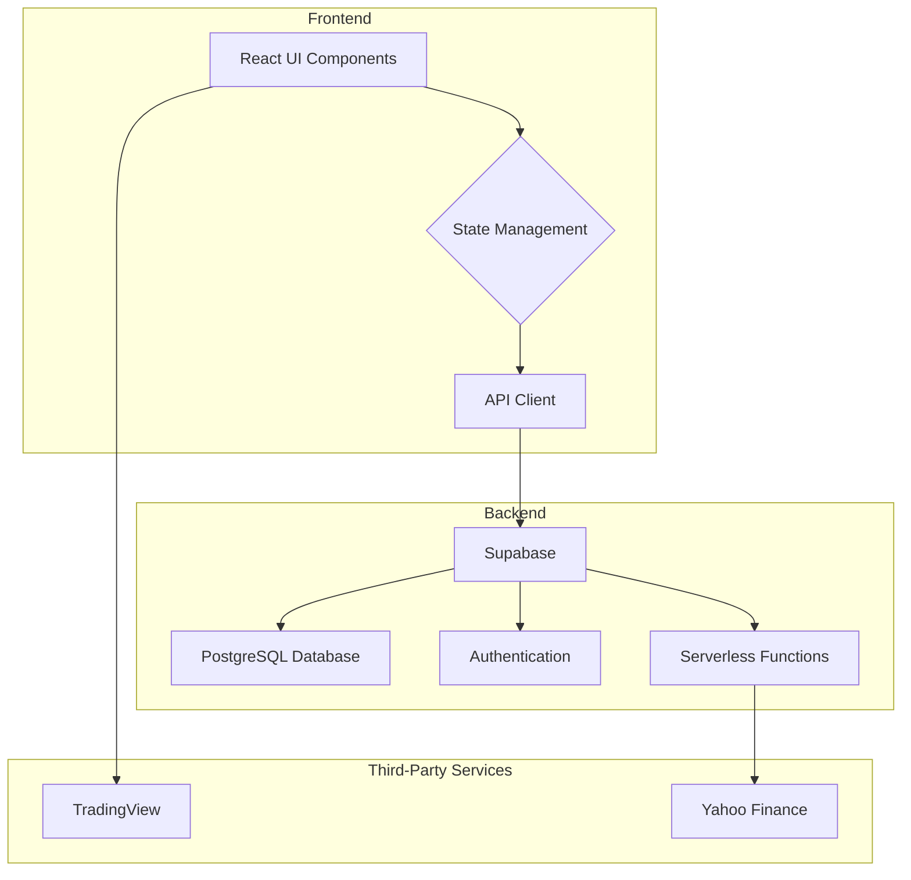
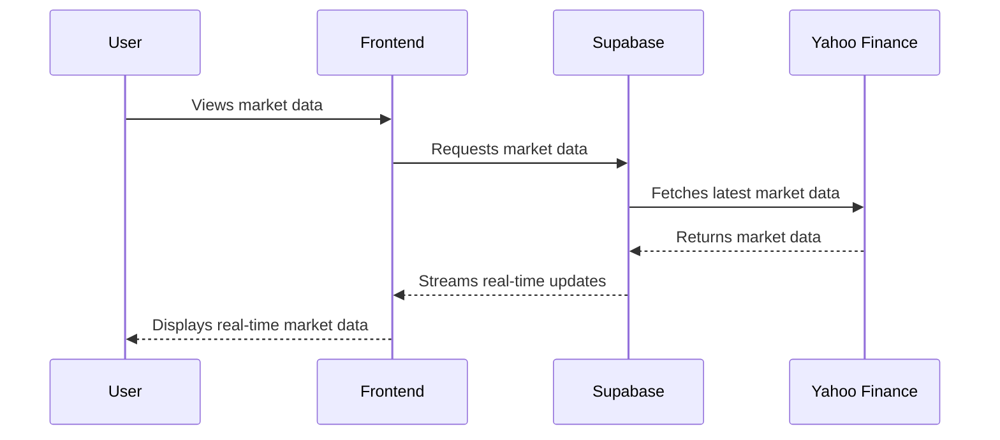

# Comprehensive Guideline Plan

This document outlines the comprehensive and meticulously structured guideline plan for the development of the Trade-Pro application.

## 1. Tech Stack

- **Frontend**: React, TypeScript, Vite, Tailwind CSS, shadcn/ui
- **Backend**: Supabase (PostgreSQL, Auth, Serverless Functions)
- **Financial Charting**: TradingView
- **Real-Time Live Market Prices**: Yahoo Finance (via Supabase serverless function)

## 2. Design Guidelines

### 2.1. Color Palette

- **Primary**: `#FF5733`
- **Secondary**: `#3357FF`
- **Accent**: `#33FF57`
- **Highlight**: `#F3FF33`
- **CTA**: `#FF33F6`

### 2.2. Fonts

- **Primary Font**: 'Roboto'
- **Font Sizes**:
    - `xs`: 12px
    - `sm`: 14px
    - `base`: 16px
    - `lg`: 18px
    - `xl`: 20px

## 3. System Architecture

## 4. Real-Time Data Flow

## 5. API Endpoints and Data Models

### 5.1. Supabase

The Supabase integration is already well-defined in the existing codebase. The data models are detailed in [`src/integrations/supabase/types.ts`](src/integrations/supabase/types.ts:1), and the client is configured in [`src/integrations/supabase/client.ts`](src/integrations/supabase/client.ts:1).

### 5.2. Yahoo Finance

The Yahoo Finance integration is handled by the `get-market-data-new` Supabase serverless function. The implementation details can be found in [`supabase/functions/get-market-data-new/`](supabase/functions/get-market-data-new/).

### 5.3. TradingView

The TradingView integration is handled by the [`TradingViewChart`](src/components/TradingViewChart.tsx:11) component, which embeds the TradingView widget in an iframe.

## 6. State Management

The state management strategy will continue to use Zustand for global state and React's built-in `useState` and `useContext` for local and component-level state.

## 7. Routing

The routing structure is defined in [`src/AppRoutes.tsx`](src/AppRoutes.tsx:1) and uses `react-router-dom`.

## 8. Navigation

The navigation structure is defined in [`src/components/Sidebar.tsx`](src/components/Sidebar.tsx:1) for desktop and [`src/components/navigation/MobileMenu.tsx`](src/components/navigation/MobileMenu.tsx:1) for mobile.

## 9. Page-by-Page Breakdown

This section will detail the components, logic, and interactions for each page.

### 9.1. Dashboard

- **Components**:
    - `WatchlistTable`
    - `TradingViewChart`
    - `QuickTradePanel`
- **Logic**:
    - Fetch and display the user's watchlist.
    - Display the TradingView chart for the selected asset.
    - Allow the user to execute quick trades.

### 9.2. Markets

- **Components**:
    - `MarketsTable`
    - `AssetRow`
- **Logic**:
    - Fetch and display a list of all available markets.
    - Allow the user to sort and filter the markets.
    - Display detailed information for each asset.

### 9.3. KYC

- **Components**:
    - `KycForm`
    - `KycStatus`
- **Logic**:
    - Allow the user to submit their KYC documents.
    - Display the user's current KYC status.

### 9.4. Portfolio

- **Components**:
    - `PortfolioSummary`
    - `PositionsTable`
- **Logic**:
    - Fetch and display the user's portfolio summary.
    - Display a list of the user's open positions.

### 9.5. Orders

- **Components**:
    - `OrdersTable`
- **Logic**:
    - Fetch and display a list of the user's open and historical orders.

### 9.6. News

- **Components**:
    - `NewsList`
    - `NewsArticle`
- **Logic**:
    - Fetch and display a list of the latest financial news.
    - Allow the user to read the full news article.

### 9.7. Wallet

- **Components**:
    - `WalletSummary`
    - `TransactionHistory`
- **Logic**:
    - Fetch and display the user's wallet summary.
    - Display a list of the user's transaction history.

### 9.8. Settings

- **Components**:
    - `SettingsForm`
- **Logic**:
    - Allow the user to update their account settings.

### 9.9. My Profile

- **Components**:
    - `ProfileForm`
- **Logic**:
    - Allow the user to update their profile information.

### 9.10. Trading Panel

- **Components**:
    - `TradeForm`
    - `OrderBook`
- **Logic**:
    - Allow the user to place trades.
    - Display the order book for the selected asset.

## 10. Next Steps

The next steps will be to implement the remaining features and functionalities as outlined in this plan. This will involve creating the necessary components, writing the required logic, and integrating with the backend services.