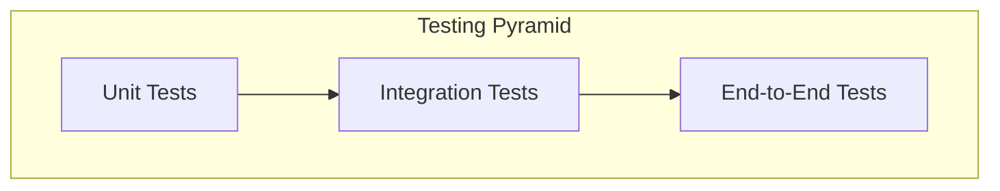

# Quality Assurance & Testing Strategy

This document outlines the quality assurance and testing strategy for the new "Markets Page" feature.

## 1. Testing Pyramid

We will adopt the "Testing Pyramid" model to ensure a balanced and effective testing strategy.

### 1.1. Unit Tests

*   **Objective**: To test individual components and functions in isolation.
*   **Scope**:
    *   All UI components (`AssetRow`, `MarketsTable`, etc.) will be tested with mock data to verify that they render correctly.
    *   All utility functions, especially the price calculation logic in the edge function, will be tested with a variety of inputs to ensure correctness.
*   **Tools**: Jest, React Testing Library.

### 1.2. Integration Tests

*   **Objective**: To test the interaction between different parts of the system.
*   **Scope**:
    *   The connection between the frontend components and the backend edge function will be tested to ensure that data is fetched and displayed correctly.
    *   The interaction between the `AddToWatchlistButton` and the Zustand store/Supabase database will be tested.
*   **Tools**: Jest, React Testing Library, Mock Service Worker (MSW) to mock API responses.

### 1.3. End-to-End (E2E) Tests

*   **Objective**: To test the entire application flow from the user's perspective.
*   **Scope**:
    *   **User Flow 1: Viewing Market Data**:
        1.  Load the Markets Page.
        2.  Verify that all asset classes are displayed.
        3.  Verify that the data in the table is correct.
    *   **User Flow 2: Adding to Watchlist**:
        1.  Load the Markets Page.
        2.  Click the `+` button on an asset.
        3.  Navigate to the Watchlist page and verify that the asset is present.
*   **Tools**: Cypress or Playwright.

## 2. Performance Testing

*   **Objective**: To ensure the application is fast, responsive, and can handle real-time updates without performance degradation.
*   **Scope**:
    *   **Load Testing**: We will simulate a large number of users accessing the page simultaneously to ensure the backend can handle the load.
    *   **Frontend Performance**: We will use tools like Lighthouse and the browser's performance profiler to identify and fix any performance bottlenecks in the UI.
    *   **Real-time Updates**: We will test the application's ability to handle a high frequency of real-time price updates without freezing or lagging.

## 3. Manual Testing

*   **Objective**: To catch any issues that may have been missed by automated tests.
*   **Scope**: A dedicated QA engineer will perform a full regression test of the feature before release, following the user stories and acceptance criteria defined in the FRD.

By implementing this comprehensive testing strategy, we can be confident that we are delivering a high-quality, "100% accurate," and bug-free feature.