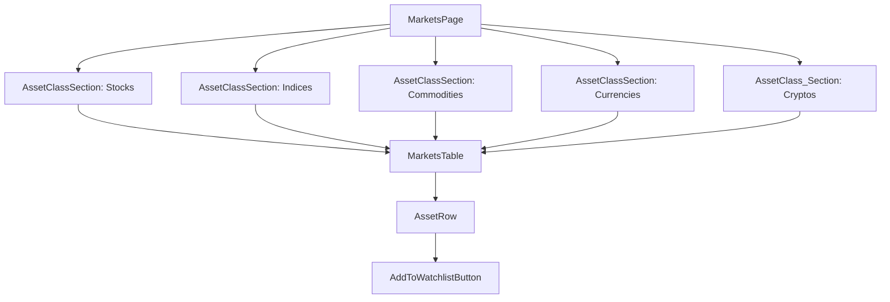

# System Architecture & Technical Specification

This document outlines the technical architecture for the new "Markets Page" feature.

## 1. Frontend Architecture

The frontend will be built using a modular, component-based architecture to ensure reusability and maintainability.

### 1.1. Component Hierarchy



*   **`MarketsPage`**: The main container component that fetches the initial list of asset classes.
*   **`AssetClassSection`**: A component that displays a single asset class (e.g., "Stocks") and contains the `MarketsTable` for that class. It will be responsible for fetching the data for its specific asset class.
*   **`MarketsTable`**: A reusable component that renders the table of assets. It will receive the asset data as props.
*   **`AssetRow`**: A component that renders a single row in the `MarketsTable`. It will display the asset's details and the `AddToWatchlistButton`.
*   **`AddToWatchlistButton`**: A button component that handles the logic for adding or removing an asset from the user's watchlist.

### 1.2. State Management

*   **Data Fetching & Caching**: We will use **React Query (or SWR)** to handle all data fetching from our backend API. This will provide us with robust caching, automatic refetching, and a non-blocking UI, which directly addresses the previous performance issues.
*   **Global UI State**: We will use **Zustand** for managing global UI state, specifically the user's watchlist. Zustand is a lightweight and simple state management library that is well-suited for this use case.

### 1.3. UI/UX Requirements

*   **Table Columns**: `+`, Asset Name, Symbol, Buy Price, Sell Price, 24h Change.
*   **Color Coding**:
    *   Buy Price: Green
    *   Sell Price: Red
    *   24h Change: Green for positive, Red for negative.
*   **Responsiveness**: The table will be designed to be fully responsive, with columns collapsing or stacking on smaller screens to ensure a good user experience on mobile devices.

## 2. Backend/Data Layer (Edge Function)

We will create a new serverless edge function at `/api/get-market-data` to act as a backend-for-frontend (BFF).

### 2.1. API Endpoint: `/api/get-market-data`

*   **Method**: `POST`
*   **Request Body**: `{ "symbols": ["AAPL", "GOOGL", "MSFT"] }`
*   **Functionality**:
    1.  **API Key Management**: The function will securely manage the Yahoo Finance API key.
    2.  **Request Batching**: It will accept an array of symbols and make a single batched request to the Yahoo Finance API. This is a critical improvement over the previous one-symbol-at-a-time approach.
    3.  **Caching**: The function will implement a 5-minute caching layer to reduce redundant API calls.
    4.  **Error Handling**: It will include robust error handling to gracefully manage API failures.
    5.  **Data Transformation**: The function will fetch the live market price and then calculate the `buy_price` and `sell_price` using the specified spread.

### 2.2. Data Transformation Logic

*   `buy_price = live_price + 0.025`
*   `sell_price = live_price - 0.025`

## 3. Database Schema

We will use a simple Supabase table to store the user's watchlist.

### `watchlist` Table

| Column Name | Data Type | Constraints | Description |
| --- | --- | --- | --- |
| `id` | `uuid` | Primary Key | Unique identifier for the watchlist item. |
| `user_id` | `uuid` | Foreign Key to `auth.users` | The ID of the user who owns the watchlist. |
| `symbol` | `text` | Not Null | The symbol of the asset in the watchlist. |
| `created_at` | `timestamp` | Not Null | The timestamp when the asset was added. |

```mermaid
erDiagram
    users ||--o{ watchlist : has
    users {
        uuid id PK
    }
    watchlist {
        uuid id PK
        uuid user_id FK
        text symbol
        timestamp created_at
    }